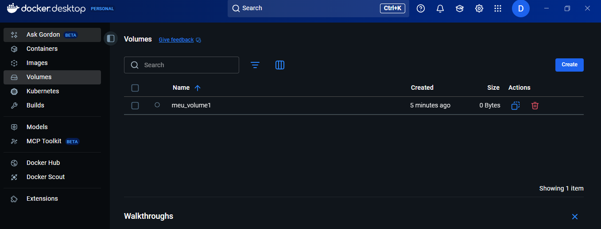

### Aula_04
### Volumes SQLite


**Criados Volume Docker:**
````
docker volume create __NOME DO VOLUME__
docker volume create volume_sqlite_aula_04
````

- Apos criar o Volume: volume_sqlite_aula_04
    - No Windows com Docker Desktop, o Docker roda por baixo de um máquina Linux virtual (WSL2).
    - Então os volumes não ficam em drive C:..., mas sim dentro dessa Máquina Virtual Linux.
    - Ou seja, você não acessa direto pelo Explorer, só através de comandos Docker.

**Ver lista de comandos do Volumes:**
````
docker volume create      →  Criar
docker volume inspect     →  Exibir informações do Volume
docker volume ls          →  Listar volumes
docker volume prune       →  Para execução de Volumes
docker volume rm __ID__   →  Remove volumes
````
### Docker Desktop
<br>



<br>

-----------------------------------------------------------------------------------------------------------------------------------

**Criação de Container:**
- cd C:\REPOSITORIO\Aula_Docker\Aula_04

- Criar o programa Python → (__app.py__)
    - No arquivo Python é definido nome do banco de dados e a execução da linha de código

- Criar o Dockerfile
    - (Imagem) instala pacotes de acesso ao SQLlite
    
<br>

**Com o Docker Desktop aberto:**
````
docker build -t imagem_sqlite_aula_04 .   →  Criar imagem
````

**Acesso do container ao volume:**
````
docker run -it `
--name container_sqlite_aula_04 `
-v volume_sqlite_aula_04:/app/data ` 
imagem_sqlite_aula_04
````

- Definições:
    - docker run → executar imagem
    - -it → deixa o terminal interativo (caso você queira usar bash ou sqlite3)
    - --name container_sqlite_aula_04 → dá um nome para o container.
    - -v volume_sqlite_aula_04:/app/data → monta o volume (já existente) no caminho dentro do container.
    - imagem_sqlite_aula_04 → é a imagem que será usada para criar o container.

    - OBS: No Docker, quando você usa o parâmetro -v nome_volume:/caminho no docker run:
        - Se o volume já existir → ele é apenas montado no caminho indicado.
        - Se o volume não existir → o Docker cria automaticamente um novo volume com esse nome e já o monta.
        - Somente a imagem "imagem_sqlite_aula_04" deve existir previamente antes de executar "docker run ..."

-----------------------------------------------------------------------------------------------------------------------------------

**Acessar container:**
````
docker start -ai __NOME DO VOLUME__
docker start -ai container_sqlite_aula_04
````

**Acessar Volume por meio de terminal bash POR UM NOVO CONTAINER:**
````
docker run -it `
--name container_sqlite_bash_aula_04 `
-v volume_sqlite_aula_04:/app/data `
imagem_sqlite_aula_04 `
bash
````

**Acesso ao novo container:**
````
docker start -ai container_sqlite_bash_aula_04
````
**Para sair do terminal bash:**
````
Ctrl+d
exit
````

-----------------------------------------------------------------------------

**Instalar SQLite dentro do container Python caso necessário:**
- No terminal bash:
````
apt update
apt install -y sqlite3
````
-----------------------------------------------------------------------------

**Criar ou selecionar um banco SQLite dentro do volume:**
- No terminal bash:
````
sqlite3 /app/data/__NOME DO BANCO SQLITE__
sqlite3 /app/data/meubanco.db
````

**No terminal SQLlite:**
````
sqlite> .tables                     →  Lista todas as tabelas do banco
sqlite> .schema clientes            →  Mostra a estrutura da tabela 'clientes' (se existir)
sqlite> SELECT * FROM clientes;     →  Exibe os dados da tabela 'clientes'
sqlite> .exit                       →  Sai do SQLite e volta ao bash
````
-----------------------------------------------------------------------------
<br>

### Docker Desktop
````
docker start -ai container_sqlite_bash_aula_04      →  Abrir container bash
````
- Terminal bash:

````
ls /app/data    →  Listar bancos
sqlite3 /app/data/novo_banco.db     → Acessar ou criar novo banco
````

- Terminal sqlite:
````
sqlite> .tables Listar tabela     → Listar tabela

sqlite> CREATE TABLE pessoa (
        id INTEGER PRIMARY KEY AUTOINCREMENT,
        nome TEXT
        );

sqlite> .tables         → Listar tabela
sqlite> .schema pessoa      → Mostra a estrutura da tabela
sqlite> INSERT INTO pessoa (nome) VALUES ('Decio Santana de Aguiar');   → Inserir dados na tabela
sqlite> SELECT * FROM pessoa;       → Exibir dados na tabela
sqlite> .exit       → Sair terminal SQLite
````

- Terminal bash:
````
ls /app/data                →   Listar bancos
rm /app/data/novo_banco.db  →   Excluir tabela
ls /app/data                →   Listar bancos
exit                        →   Sair terminal bash
````