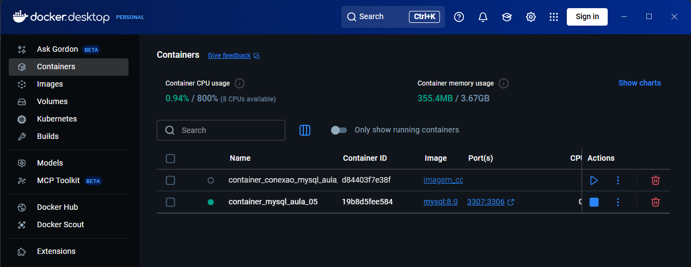
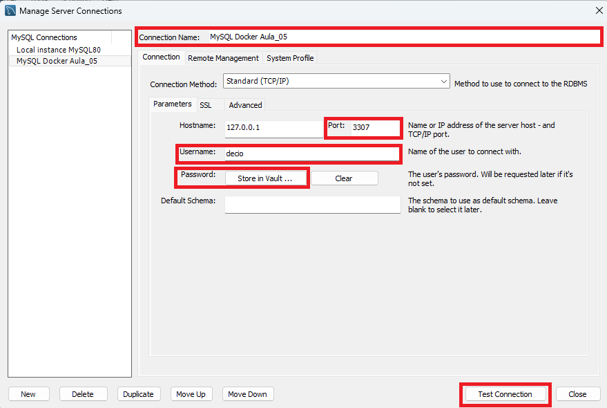

### Aula_05
### Volumes MySQL

### **Criados Volume Docker:**
````
docker volume create volume_mysql_aula_05
````
-----------------------------------------------------------------------------------------------------------

### **Criar um Container MySQL no Volume Docker:** 
````
- docker run -d --name  __NOME DO CONTAINER MYSQL__ `
- -e MYSQL_ROOT_PASSWORD=__SENHA DO MYSQL WORKBENCH__ `
- -e MYSQL_DATABASE=__NOME DO BANCO MYSQL DOCKER__ `
- -e MYSQL_USER=__CRIA USUÁRIO DOCKER__ `
- -e MYSQL_PASSWORD=__SENHA USUÁRIO DOCKER__ `
- -v __NOME DO VOLUME__:/var/lib/mysql `
- -p 3307:3306 `
- --character-set-server=utf8mb4 `
- --collation-server=utf8mb4_general_ci `
- --skip-character-set-client-handshake `
- mysql:8.0 `
- --character-set-server=utf8mb4 → Define UTF-8 completo, compatível com acentos e emojis.
- --collation-server=utf8mb4_general_ci → Define a ordenação (case-insensitive e compatível com português).
- --skip-character-set-client-handshake → Força o servidor a usar sempre UTF-8, mesmo que o cliente peça outro encoding.
````

O que cada parte faz:

- docker run → roda o Docker.
- -d → roda em segundo plano.
- --name __NOME DO CONTAINER MYSQL__ → Nome do container dentro do Volume Docker.
- -e MYSQL_ROOT_PASSWORD=__SENHA DO MYSQL WORKBENCH__ → Senha do usuário root MySQL.
- -e MYSQL_DATABASE=__NOME DO BANCO MYSQL DOCKER__ → Cria um banco para o Volume do Docker.
- -e MYSQL_USER=__CRIA USUÁRIO DOCKER__ → Cria um usuário para acesso Volume do Docker.
- -e MYSQL_PASSWORD=__SENHA USUÁRIO DOCKER__ → Cria um senha para acesso Volume do Docker.
- -v __NOME DO VOLUME__:/var/lib/mysql → Monta o volume no diretório de dados do MySQL.
- -p 3307:3306 → Mapeando porta diferente da porta do MySQL localhost root
- mysql:8.0 → Nome da imagem usada para criar o contêiner (oficial do MySQL (versão 8.0) disponível no Docker Hub).
- --character-set-server=utf8mb4 `
- --collation-server=utf8mb4_general_ci `
- --skip-character-set-client-handshake

<br>

- Mapeando porta o que isso significa:
    - -p 3307:3306 → -porta host:container
        - 3306 → é a porta interna do container, ou seja, a porta que o MySQL está escutando dentro do container.
        - 3307 → é a porta externa do host, ou seja, a porta que você vai usar no seu computador (Windows, Linux, etc.) para se conectar ao MySQL que está dentro do container.
        - Mapeamento das portas (host:container): permite que uma porta do host “apontar” para uma porta específica do container.

<br>

Dados do Container MySQL:
````
docker run -d `
--name container_mysql_aula_05 `
-e MYSQL_ROOT_PASSWORD=Enigma.2 `
-e MYSQL_DATABASE=banco_docker `
-e MYSQL_USER=decio `
-e MYSQL_PASSWORD=decio123 `
-v volume_mysql_aula_05:/var/lib/mysql `
-p 3307:3306 `
mysql:8.0 `
--character-set-server=utf8mb4 `
--collation-server=utf8mb4_general_ci `
--skip-character-set-client-handshake
````

**Verificar o Volume:**
````
docker volume ls
docker volume inspect volume_mysql_aula_05
````

-----------------------------------------------------------------------------------------------------------

### **Criar uma rede Docker:**
````
docker network create rede_banco_mysql_aula_05
````
### **Conectar container MySQL na rede criada:**
````
docker network connect rede_banco_mysql_aula_05 container_mysql_aula_05
````
**Identificar conexão da rede ao container:**
````
docker network inspect rede_banco_mysql_aula_05     → Procurar por Container
docker inspect container_mysql_aula_05      → Procurar por rede_banco_mysql_aula_05
````
**Comandos para rede:**
````
docker network create __NOME DA REDE CONEXÃO__  → Criar rede de conexão Docker
docker network ls   → Visualizar lista rede
docker network inspect __NOME DA REDE CONEXÃO__     →  Inspecionar rede
docker network disconnect __NOME DA REDE CONEXÃO__ __NOME DA IMAGEM__   →  Desconectar rede do container
docker network connect __NOME DA REDE CONEXÃO__ __NOME DA IMAGEM__ → Conectar rede do container
docker network rm __NOME DA REDE CONEXÃO__      →  Excluir container rede
````

**Listar containers:**
````
docker ps -a
````

**Rodar o container:**
````
docker exec -it container_mysql_aula_05 bash
````

**Instalação de pacotes para acesso ao MySQL:**
- **No bash (Terminal):**
````
microdnf install -y procps iputils telnet
````

**Conexão TCP com outra rede:**
````
mysql -h container_mysql_aula_05 -u decio -p

mysql -h 127.0.0.1 -u decio -p

Enter password: decio123
````

**Acessar o terminal MySQL**
- **Terminal mysql:**
````
SHOW DATABASES;     → Ver bancos
USE banco_docker;   → Acessar Banco
SHOW TABLES;        → Ver bancos

CREATE TABLE pessoa (
    id INT AUTO_INCREMENT PRIMARY KEY,
    nome VARCHAR(100) NOT NULL
);

INSERT INTO pessoa (nome) VALUES ('João Silva'), ('Maria Oliveira'), ('Décio Santana'); → Inserir dados
SELECT * FROM pessoa;   → Exibir dados
SHOW DATABASES;     → Ver bancos
SHOW TABLES;        → Ver bancos
exit;               → Sair terminal MySQL
````
**Sair do terminal bash**
- **No bash (Terminal):**
````
exit
````

-----------------------------------------------------------------------------------------------------------

### **Ativar o Container MySQL:**
````
docker start container_mysql_aula_05
````



### **Criar banco de dados no MySQL Workbench com os Dados do Container MySQL**


### **MySQL Workbench**



-----------------------------------------------------------------------------------------------------------

<br>

# Conteudos Extras

### Executar o Dockerfile para teste de conexão MySQL

**Criar o Dockerfile**
- Arquivo de construção de imagens Docker.

**Criar o programa Python (__app.py__)**
- Arquivo de teste banco de dados MySQL.

### **Criar container para rede de conexão MySQL:**
````
docker build -t imagem__testeconexao_mysql_aula_05 .      →   Criar container
````
**Rodar o container Python:**
````
docker run -d `
--name container_teste_conexao_mysql_aula_05 `
--network rede_banco_mysql_aula_05 `
imagem_teste_conexao_mysql_aula_05
````

- Definições:
    - docker run → Cria e executa um novo container.
    - -d → O container não executa de imediato.
    - --name container_teste_conexao_mysql_aula_05 → Dá um nome específico ao container. Sem isso, o Docker gera um nome aleatório.
    - --network rede_banco_mysql_aula_05 → Conecta o container a uma rede Docker específica.
    - imagem_teste_conexao_mysql_aula_05 → Indica a imagem que será usada para criar o container.