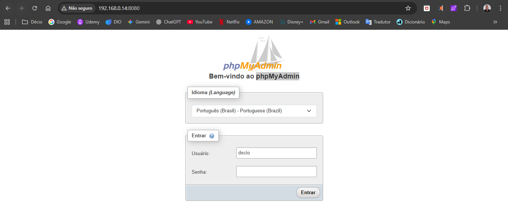
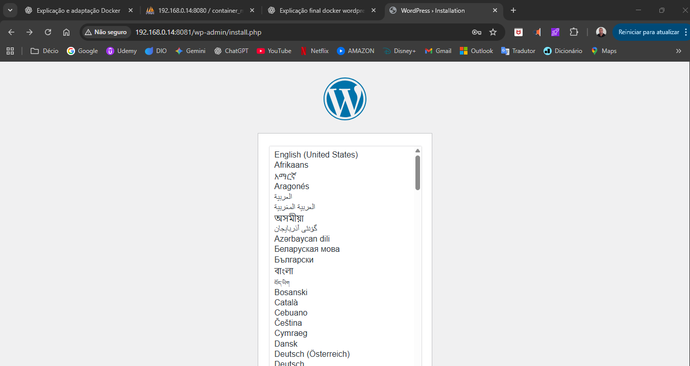

__Host → phpMyAdmin → MySQL__


### __CRIAR REDE CONEXÃO__
````
docker network create __NOME DA REDE CONEXÃO__
docker network create rede_mysql_Aula06
````
__INSPECIONAR REDE CONEXÃO__
````
docker network inspect __NOME DA REDE CONEXÃO__
docker network inspect rede_mysql_Aula06
````
__LISTAR REDES CONEXÕES__
````
docker network ls
````
---------------------------------------------------------------------------------------------------------

### __CRIAR MySQL__
````
docker run -d `
--name container_mysql_Aula06 `
--network rede_mysql_Aula06 `
-e MYSQL_ROOT_PASSWORD=Enigma.2 `
-e MYSQL_DATABASE=banco_docker `
-e MYSQL_USER=decio `
-e MYSQL_PASSWORD=dsa `
-v volume_mysql_Aula06:/var/lib/mysql `
-p 3307:3306 `
mysql:8.0
````

- Definição: 
  - docker run → roda o Docker.
  - -d → roda em segundo plano.
  - --name __NOME DO CONTAINER MYSQL__ → nome do container dentro do Volume Docker.
  - -e MYSQL_ROOT_PASSWORD=__SENHA DO MYSQL WORKBENCH__ →senha do usuário root MySQL.
  - -e MYSQL_DATABASE=__NOME DO BANCO MYSQL DOCKER MYSQL__ → cria um banco para o Volume do Docker.
  - -e MYSQL_USER=__CRIA USUÁRIO DOCKER MYSQL__ → cria um usuário para acesso Volume do Docker.
  - -e MYSQL_PASSWORD=__SENHA USUÁRIO DOCKER MYSQL__ → cria um senha para acesso Volume do Docker.
  - -v __NOME DO VOLUME__:/var/lib/mysql → monta o volume no diretório de dados do MySQL.
  - -p 3307:3306 → mapeando porta diferente da porta do MySQL localhost root
  - mysql:8.0 → Nome da imagem usada para criar o contêiner (oficial do MySQL (versão 8.0) disponível no Docker Hub).
  

- Mapeando porta o que isso significa:
    - -p 3307:3306 → -porta host:container
        - 3306 → é a porta interna do container, ou seja, a porta que o MySQL está escutando dentro do container.
        - 3307 → é a porta externa do host, ou seja, a porta que você vai usar no seu computador (Windows, Linux, etc.) para se conectar ao MySQL que está dentro do container.
        - Mapeamento das portas (host:container): permite que uma porta do host “apontar” para uma porta específica do container.

<br>

__LISTAR CONTAINER__
````
docker ps -a
````
__EXECUTAR DOCKER__
````
docker exec -it __NOME DO CONTAINER MYSQL__ __TERMINAL__
docker exec -it container_mysql_Aula06 bash
````
__INSTALAÇÃO DE PACOTES PARA ACESSO AO MySQL__

- **NO bash (Terminal):**
````
apt-get update
apt-get install telnet  → Instalar telnet
````
- Definição:
  - OBS: A imagem oficial mysql:8.0 é baseada em Oracle Linux, que não usa apt (Debian/Ubuntu), mas sim dnf ou microdnf (RedHat/Fedora/Oracle Linux). Por isso apt-get e apt não existem.

- microdnf install -y procps iputils telnet
  - Definição:
    - No caso desta imagem (mysql:8.0 atual), ela usa Oracle Linux → então o correto é usar microdnf, apt nunca vai estar disponível.

__CONEXÃO TCP COM OUTRA REDE__

- **NO bash (Terminal):**
````
telnet __ID OU NOME DO CONTAINER MYSQL__ __PORTA__
telnet container_mysql_Aula06 3306
````
- Definição:
  - telnet → é um programa cliente que abre uma conexão TCP com outro host em uma porta específica.
  - container_mysql_Aula06 → é o nome do host (ou container, ou servidor) que você quer acessar. 
  No Docker, normalmente é o nome do container ou um alias dentro de uma rede Docker.
  - 3306 → é a porta padrão do MySQL, usada para conexões de banco de dados.

__ACESSAR TERMINAL (MySQL)__
- **NO bash (Terminal):**
````
mysql -h container_mysql_Aula06 -u decio -p
Enter password: dsa
````

__MySQL__
- **Terminal mysql:**
````
SHOW DATABASES;   → Ver bancos
USE banco_docker;   → Acessar Banco
SHOW TABLES; ()   → Ver bancos
exit;   → Sair terminal MySQL
````
__SAIR DO TERMINAL BASH__
- **No bash (Terminal):**
```
exit
```
---------------------------------------------------------------------------------------------------------

### __CRIAR phpMyAdmin__
````
docker run -d `
--name container_php_Aula06 `
-h phpma_server_Aula06 `
--network rede_mysql_Aula06 `
-p 8080:80 `
-e PMA_HOST=container_mysql_Aula06 `
phpmyadmin/phpmyadmin
````
- Definição:
  - docker run → Cria e executa um contêiner a partir de uma imagem Docker.
  - -d → Executa em segundo plano (modo detached). O terminal não fica preso ao contêiner.
  - --name __NOME PERSONALIZADO DO CONTAINER PHP__ → Dá um nome amigável ao contêiner, em vez de deixar o Docker gerar um nome aleatório.
  - -h __NOME PERSONALIZADO DO HOST INTERNO DO CONTAINER PHP__ → Define o hostname interno do contêiner Docker.
  - --network __NOME DA REDE CONEXÃO__ → Conecta o contêiner a uma rede Docker personalizada.
      Isso permite que ele se comunique com outros contêineres na mesma rede (exemplo: o banco mariadb-server).
  - -p 8080:80 → Faz o mapeamento de portas:
      Porta 80 → é a porta padrão do Apache dentro do contêiner (onde o phpMyAdmin roda).
      Porta 8080 → é a porta do host (seu PC) usada para acessar no navegador.
      Assim, você acessa o phpMyAdmin em: http://localhost:8080
  - -e PMA_HOST=mariadb-server → Define uma variável de ambiente no contêiner.  
      PMA_HOST → diz ao phpMyAdmin qual servidor MySQL/MariaDB ele deve conectar.
  - phpmyadmin/phpmyadmin → Nome da imagem usada para criar o contêiner (oficial do phpMyAdmin disponível no Docker Hub).


__LISTAR CONTAINER__
````
docker ps -a
````

__EXECUTAR DOCKER__
````
docker exec -it container_php_Aula06 bash
````
__ACESSAR TERMINAL (PHP)__

- No bash (Terminal):


````
hostname    →  Host interno do container

telnet __NOME PERSONALIZADO DO HOST INTERNO DO CONTAINER__ 8080
telnet phpma_server_Aula06 8080
````
- Definições:
  - Instalar telnet caso necessário:
    - apt-get update
    - apt-get install -y telnet

__SAIR DO TERMINAL BASH__
- No bash (Terminal):
````
exit
````
__TESTE CONEXÃO DA REDE PORTA 8080__
````
Test-NetConnection -ComputerName localhost -Port 8080   
````
---------------------------------------------------------------------------------------------------------

### __EXIBIR INFORMAÇÃO DA REDE (IP)__
````
ipconfig
````
- Procure as informações IPv4:
- Endereço IPv4 : 192.168.?.?
- Acesse o navegador endereço IPv4 porta 8080:
- Endereço IPv4 no navegador: 192.168.?.?:8080

### __EXIBIR INFORMAÇÃO DA REDE (IP)__
````
Get-NetIPConfiguration
````
- Procure as informações IPv4:
- IPv4Address : 192.168.?.?
- Acesse o navegador endereço IPv4 porta 8080:
- Endereço IPv4 no navegador: 192.168.?.?:8080


__MYSQL__
````
Usuário: decio
Senha: dsa
````

---------------------------------------------------------------------------------------------------------

### __CRIAR WORDPRESS__
````
docker run -d `
--name container_wordpress_Aula06 `
-h wordpress_server_Aula06 `
--network rede_mysql_Aula06 `
-e WORDPRESS_DB_HOST=container_mysql_Aula06 `
-e WORDPRESS_DB_NAME=banco_docker `
-e WORDPRESS_DB_USER=decio `
-e WORDPRESS_DB_PASSWORD=dsa `
-v volume_wordpress_Aula06:/var/www/html/wp-content `
-p 8081:80 `
wordpress
````

- Definição:
  - docker run -d → Cria e executa um contêiner a partir de uma imagem Docker.
  - --name __NOME PERSONALIZADO DO CONTAINER WORDPRESS__  → Nome do container WordPress.
  - -h __NOME PERSONALIZADO DO HOST INTERNO DO CONTAINER WORDPRESS__ → Hostname do container WordPress.
  - --network __NOME DA REDE CONEXÃO__ → Conecta na mesma rede do MySQL e phpMyAdmin.
  - -e WORDPRESS_DB_HOST=__NOME PERSONALIZADO DO CONTAINER MYSQL__ → Aponta para o MySQL (igual o phpMyAdmin).
  - -e WORDPRESS_DB_NAME=__NOME DO BANCO MYSQL__ → Nome do banco criado no MySQL.
  - -e WORDPRESS_DB_USER=__NOME USUÁRIO MYSQL__ → Usuário criado no MySQL.
  - -e WORDPRESS_DB_PASSWORD=__SENHA DO USUÁRIO MYSQL__ → Senha do usuário MySQL.
  - -v __NOME DO VOLUME  WORDPRESS__:/var/www/html/wp-content → Volume para armazenar plugins, temas e uploads.
  - -p 8081:80 → Expõe o WordPress em http://localhost:8081.
  - wordpress → Nome da imagem usada para criar o contêiner (oficial do Wordpress disponível no Docker Hub).

__LISTAR CONTAINER__
````
docker ps -a
````
__EXECUTAR DOCKER__
````
docker exec -it container_wordpress_Aula06 bash
````
__ACESSAR TERMINAL (WORDPRESS)__
- No bash (Terminal):
````
df    → Mostra o uso do espaço em disco do container
exit
````
__EXIBIR INFORMAÇÃO DA REDE (IP)__
````
Get-NetIPConfiguration
````
- Procure as informações IPv4:
  - IPv4Address : 192.168.?.?

- Acesse o navegador endereço IPv4 porta 8081:
  - Endereço IPv4 no navegador: 192.168.?.?:8081

- Assim, Teremos:
  - MySQL rodando na porta 3307.
  - phpMyAdmin acessível em http://localhost:8080.
  - WordPress acessível em http://localhost:8081.



